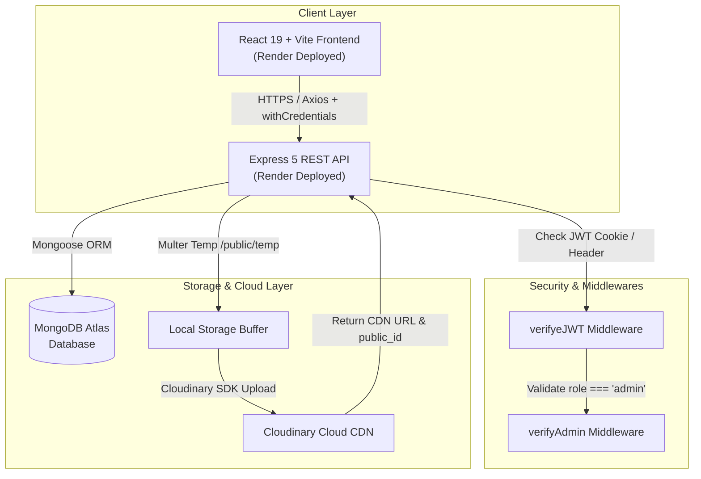
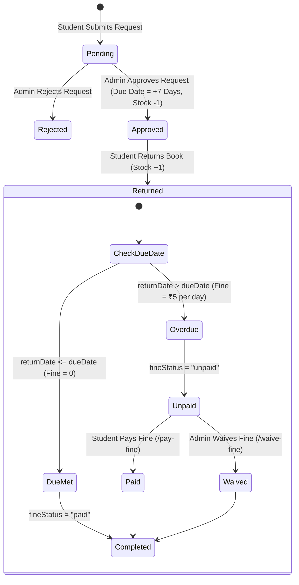

# 📚 Library Management System (LMS)

[](https://lms-frontend-25jw.onrender.com)
[](https://lms-xcsu.onrender.com/api/v1)
[](https://react.dev/)
[](https://nodejs.org/)
[](https://www.mongodb.com/)
[](https://tailwindcss.com/)

> A robust, full-stack, role-based Library Management web application built with the MERN stack. Features automated book issue workflows, real-time inventory tracking, automatic overdue fine calculations (₹5/day), Cloudinary image uploads, secure JWT + HTTP-only cookie authentication, and community event announcements.

---

## 🔗 Live Deployments

* 🌐 **Frontend Application**: [https://lms-frontend-25jw.onrender.com](https://lms-frontend-25jw.onrender.com)
* ⚙️ **Backend API Base**: [https://lms-xcsu.onrender.com/api/v1](https://lms-xcsu.onrender.com/api/v1)

---

## 📋 Table of Contents

- [Overview](#-overview)
- [Key Features](#-key-features)
  - [Student / Member Portal](#student--member-portal)
  - [Admin Dashboard & Control](#admin-dashboard--control)
- [Tech Stack](#-tech-stack)
- [System Architecture](#-system-architecture)
- [Project Directory Structure](#-project-directory-structure)
- [Authentication & Role Authorization](#-authentication--role-authorization)
- [Book Management & Automated Inventory](#-book-management--automated-inventory)
- [Issue & Return Lifecycle (With Fine Automation)](#-issue--return-lifecycle-with-fine-automation)
- [REST API Reference](#-rest-api-reference)
  - [User Endpoints (`/api/v1/users`)](#1-user-endpoints-apiv1users)
  - [Book & Issue Endpoints (`/api/v1/books`)](#2-book--issue-endpoints-apiv1books)
  - [Event Endpoints (`/api/v1/events`)](#3-event-endpoints-apiv1events)
- [Database Models & Schemas](#-database-models--schemas)
- [Environment Variables](#-environment-variables)
- [Local Installation & Setup](#-local-installation--setup)
- [Running the Project](#-running-the-project)
- [Deployment Guide](#-deployment-guide)
- [Security Features](#-security-features)
- [Author & License](#-author--license)

---

## 🌟 Overview

The **Library Management System (LMS)** simplifies library operations and digitizes the borrowing lifecycle for academic and public institutions.

### Why this project?
- **Zero Manual Logs**: Eliminates manual register entry and paper receipts.
- **Automated Book Stock**: Inventory copies decrement upon issue approval and increment automatically upon return.
- **Smart Fine Engine**: Automatically calculates overdue charges based on return timestamps and allows fine settlement or administrative waivers.
- **Modern User Experience**: Instant search, category filters, responsive navigation, and animated toast feedback.

---

## ✨ Key Features

### Student / Member Portal
- 👤 **Account & Profile**: Member registration with custom avatar upload via Cloudinary, login, and secure profile/password updates.
- 🔍 **Catalog Exploration**: Real-time search across title, author, category, and ISBN with instant filtering.
- 📖 **Single-Click Book Requests**: Request books directly with duplicate request prevention.
- 📊 **My Issues Dashboard**: Real-time status tracking for requested, approved, returned, or rejected books.
- ⏰ **Due Date & Fine Alerts**: Clear indicators for due dates (7-day borrowing window) and automated overdue fine alerts.
- 💳 **Fine Settlement**: Built-in flow to pay overdue fines directly.
- 📅 **Library Events**: View upcoming workshops, seminars, and library notices.

### Admin Dashboard & Control
- 📈 **Library Metrics**: Real-time aggregate counters for total catalog books, registered members, active borrows, and completed returns.
- 📚 **Full Book Catalog CRUD**: Add new books with cover images, edit details/copies, and delete entries.
- 🛡️ **Request Moderation**: Approve or reject pending student book issue requests.
- 🔄 **Return Processing**: Mark returned books with automatic inventory restocking and instant fine generation if overdue.
- 💰 **Fine Management**: Waive fines for students or track completed payments.
- 📋 **Global Issues Inspector**: Filter and search through all transactions by status (`pending`, `approved`, `returned`, `rejected`).
- 📢 **Event Administration**: Post and remove institution events and announcements.

---

## 🧪 Tech Stack

### Frontend
- **Framework**: [React 19](https://react.dev/)
- **Build Tool**: [Vite](https://vitejs.dev/)
- **Routing**: [React Router DOM v7](https://reactrouter.com/)
- **Styling**: [Tailwind CSS v4](https://tailwindcss.com/)
- **Animations**: [Framer Motion](https://www.framer.com/motion/)
- **Icons**: [React Icons](https://react-icons.github.io/react-icons/)
- **HTTP Client**: [Axios](https://axios-http.com/) (with cross-origin credentials)
- **Notifications**: [React Hot Toast](https://react-hot-toast.com/)

### Backend
- **Runtime**: [Node.js](https://nodejs.org/) (ES Modules)
- **Framework**: [Express.js v5](https://expressjs.com/)
- **Database Driver**: [Mongoose v9](https://mongoosejs.com/)
- **Authentication**: [JSON Web Tokens (JWT)](https://jwt.io/) & [bcrypt](https://github.com/kelektiv/node.bcrypt.js)
- **Session Security**: `cookie-parser` (HTTP-only cookies)
- **File Uploads**: [Multer](https://github.com/expressjs/multer) (temp disk buffer) + [Cloudinary](https://cloudinary.com/) (cloud CDN)
- **CORS**: Configured with dynamic origin whitelist

### Database & Cloud
- **Database**: [MongoDB Atlas](https://www.mongodb.com/cloud/atlas)
- **Cloud Storage**: [Cloudinary](https://cloudinary.com/)
- **Hosting**: [Render](https://render.com/)

---

## 🏗️ System Architecture



---

## 📁 Project Directory Structure

```text
LMS/
├── backend/
│   ├── public/
│   │   └── temp/                      # Temporary buffer for Multer file uploads
│   ├── src/
│   │   ├── controllers/
│   │   │   ├── book.controller.js     # Book CRUD & aggregate library stats
│   │   │   ├── event.controller.js    # Event announcements logic
│   │   │   ├── issebook.controller.js # Issue requests, approvals, returns, fine engine
│   │   │   └── user.controller.js    # Auth, avatar update, profile & token renewal
│   │   ├── db/
│   │   │   └── ConnectDB.js           # Mongoose MongoDB connection handler
│   │   ├── middlewares/
│   │   │   ├── admin.middleware.js    # Admin role verification guard
│   │   │   ├── auth.middleware.js     # JWT token verification middleware
│   │   │   └── multer.middleware.js   # Multipart form disk storage handler
│   │   ├── model/
│   │   │   ├── Announcement.model.js  # Announcement schema
│   │   │   ├── Book.model.js          # Book catalog schema & indexes
│   │   │   ├── Event.model.js         # Library events schema
│   │   │   ├── Issue.model.js         # Book issue & fine tracking schema
│   │   │   └── User.Model.js          # User credentials & role schema
│   │   ├── routes/
│   │   │   ├── book.route.js          # /api/v1/books router
│   │   │   ├── event.route.js         # /api/v1/events router
│   │   │   └── user.route.js          # /api/v1/users router
│   │   ├── services/
│   │   │   └── cloudinary.service.js  # Cloudinary file upload & auto-cleanup
│   │   ├── utils/
│   │   │   ├── ApiError.js            # Standardized API error response
│   │   │   ├── ApiResponse.js         # Standardized API payload response
│   │   │   └── asyncHandler.js        # Async try/catch controller wrapper
│   │   └── Constants.js               # Global constants
│   ├── .env                           # Backend environment config
│   ├── App.js                         # Express configuration, CORS, cookies, route bindings
│   ├── Index.js                       # Server entry point & DB bootstrap
│   └── package.json
│
└── frontend/
    ├── public/
    ├── src/
    │   ├── assets/                    # Static images, icons, illustrations
    │   ├── components/
    │   │   ├── admin/                 # Admin modal, issue rows & statistics
    │   │   ├── cards/                 # Reusable book cards & event cards
    │   │   ├── common/                # Layout, header, footer & loader components
    │   │   ├── home/                  # Landing page hero, stats & preview sections
    │   │   ├── student/               # Student issue table & fine modal components
    │   │   └── ui/                    # Buttons, Inputs, Dialogs & Dropdowns
    │   ├── context/
    │   │   ├── AuthContext.jsx        # Authentication state, login/logout handlers
    │   │   └── ThemeContext.jsx       # Theme state provider
    │   ├── pages/
    │   │   ├── AddBook.jsx            # Book creation view (Admin)
    │   │   ├── AdminDashboard.jsx     # Comprehensive admin management panel
    │   │   ├── Books.jsx              # Public catalog listing with search & filters
    │   │   ├── Home.jsx               # Landing page with stats & upcoming events
    │   │   ├── Login.jsx              # User & admin sign-in page
    │   │   ├── NotFound.jsx           # 404 error page
    │   │   ├── Profile.jsx            # User profile, avatar change & password change
    │   │   ├── Register.jsx           # User registration with avatar upload
    │   │   └── StudentDashboard.jsx   # Student personal issues & history panel
    │   ├── services/
    │   │   └── api.js                 # Configured Axios client with dynamic environment URLs
    │   ├── App.jsx                    # Route switch & protected route tree
    │   ├── main.jsx                   # React root entry point
    │   └── index.css                  # Tailwind CSS setup & global styles
    ├── .env.development              # Development environment variables
    ├── .env.production               # Production environment variables
    ├── vite.config.js
    └── package.json
```

---

## 🔐 Authentication & Role Authorization

1. **Password Security**: Passwords are automatically hashed with `bcrypt` (10 salt rounds) prior to database insertion.
2. **Dual-Token System**:
   - **Access Token**: Short-expiry JWT containing user identity (`id`, `email`, `role`).
   - **Refresh Token**: Stored securely in MongoDB to allow seamless token refreshment without logging out.
3. **HTTP-only Cookies**: Both tokens are dispatched via `httpOnly`, `sameSite` secure cookies to mitigate Cross-Site Scripting (XSS).
4. **Role-Based Access Control (RBAC)**:
   - `verifyeJWT`: Authenticates token from cookie or `Authorization: Bearer <token>` header.
   - `verifyAdmin`: Confirms `req.user.role === 'admin'`. Denies non-admin access with `403 Forbidden`.

---

## 📚 Book Management & Automated Inventory

- **Dynamic Availability**:
  $$\text{availableCopies} \le \text{copies}$$
- **When an issue is APPROVED**: `availableCopies` decrements by 1.
- **When an issue is RETURNED**: `availableCopies` increments by 1.
- **Text Search Indexing**: MongoDB compound text index on `{ title, author, isbn }` for ultra-fast full-text searches.

---

## 🔄 Issue & Return Lifecycle (With Fine Automation)



### Overdue Fine Formula:
$$\text{Days Overdue} = \left\lceil \frac{\text{returnDate} - \text{dueDate}}{1000 \times 60 \times 60 \times 24} \right\rceil$$
$$\text{Fine Amount (₹)} = \max(0, \text{Days Overdue} \times 5)$$

---

## 📡 REST API Reference

### Base URL: `/api/v1`

### 1. User Endpoints (`/api/v1/users`)
| Method | Endpoint | Description | Auth Required | Role |
| :--- | :--- | :--- | :---: | :---: |
| `POST` | `/users/register` | Register a new member (with avatar) | No | Public |
| `POST` | `/users/login` | Login user & set auth cookies | No | Public |
| `POST` | `/users/logout` | Invalidate tokens & clear cookies | Yes | Any |
| `POST` | `/users/refresh-token` | Renew access token via refresh token | No | Public |
| `GET` | `/users/me` | Fetch logged-in user profile | Yes | Any |
| `PATCH` | `/users/update-profile` | Update account details (name, contact) | Yes | Any |
| `PATCH` | `/users/change-password` | Change user password | Yes | Any |
| `PATCH` | `/users/avtar` | Update profile picture (Cloudinary) | Yes | Any |

### 2. Book & Issue Endpoints (`/api/v1/books`)
| Method | Endpoint | Description | Auth Required | Role |
| :--- | :--- | :--- | :---: | :---: |
| `GET` | `/books/stats` | Get aggregate library metrics (books, users, issues) | No | Public |
| `GET` | `/books/get-all-Books` | List books (search, filter, pagination) | No | Public |
| `GET` | `/books/get-book/:id` | Fetch details of a specific book | No | Public |
| `POST` | `/books/add-book` | Add a new book (with cover image) | Yes | **Admin** |
| `PATCH` | `/books/update-book/:id` | Update book information or cover | Yes | **Admin** |
| `DELETE` | `/books/delete-book/:id` | Remove a book from the catalog | Yes | **Admin** |
| `POST` | `/books/request/:id` | Submit a book borrowing request | Yes | Student |
| `POST` | `/books/approve/:id` | Approve student issue request | Yes | **Admin** |
| `POST` | `/books/reject/:id` | Reject student issue request | Yes | **Admin** |
| `POST` | `/books/return/:id` | Mark book returned & compute fine | Yes | **Admin** |
| `POST` | `/books/pay-fine/:id` | Pay overdue fine for an issue record | Yes | Any |
| `POST` | `/books/waive-fine/:id` | Waive fine for an issue record | Yes | **Admin** |
| `GET` | `/books/my-issues` | Get logged-in student's issue history | Yes | Student |
| `GET` | `/books/all-issues` | Fetch all issues across library | Yes | **Admin** |

### 3. Event Endpoints (`/api/v1/events`)
| Method | Endpoint | Description | Auth Required | Role |
| :--- | :--- | :--- | :---: | :---: |
| `GET` | `/events` | Get all upcoming library events | No | Public |
| `POST` | `/events/create` | Publish a new library event | Yes | **Admin** |
| `DELETE` | `/events/delete/:id` | Delete an existing event | Yes | **Admin** |

---

## 🗄️ Database Models & Schemas

### User Schema (`User.Model.js`)
```javascript
{
  firstName:    { type: String, required: true, trim: true },
  lastName:     { type: String, required: true, trim: true },
  email:        { type: String, required: true, unique: true, trim: true, lowercase: true },
  contact:      { type: Number, required: true },
  password:     { type: String, required: true },
  avatar:       { type: String, default: "" },
  role:         { type: String, enum: ["student", "admin"], default: "student" },
  reFreshToken: { type: String }
} // timestamps: true
```

### Book Schema (`Book.model.js`)
```javascript
{
  title:           { type: String, required: true, trim: true },
  description:     { type: String, trim: true },
  cover:           { url: String, public_id: String },
  category:        { type: String, trim: true, lowercase: true },
  author:          { type: String, trim: true, lowercase: true },
  copies:          { type: Number, required: true },
  availableCopies: { type: Number, required: true },
  isbn:            { type: String, required: true, unique: true, trim: true }
} // timestamps: true
// Text indexes on: title, author, isbn
```

### Issue Schema (`Issue.model.js`)
```javascript
{
  user:       { type: Schema.Types.ObjectId, ref: "User", required: true },
  book:       { type: Schema.Types.ObjectId, ref: "Book", required: true },
  issueDate:  { type: Date, default: Date.now },
  dueDate:    { type: Date },
  returnDate: { type: Date },
  status:     { type: String, enum: ["pending", "approved", "returned", "rejected"], default: "pending" },
  approvedBy: { type: Schema.Types.ObjectId, ref: "User" },
  fineAmount: { type: Number, default: 0 },
  fineStatus: { type: String, enum: ["unpaid", "paid", "waived"], default: "unpaid" }
} // timestamps: true
```

### Event Schema (`Event.model.js`)
```javascript
{
  title:       { type: String, required: true, trim: true },
  description: { type: String, required: true, trim: true },
  date:        { type: String, required: true },
  time:        { type: String, default: "10:00 AM - 4:00 PM" },
  location:    { type: String, default: "Central Library Auditorium" },
  category:    { type: String, default: "Workshop", trim: true },
  image:       { type: String },
  speaker:     { type: String, default: "Guest Speaker" }
} // timestamps: true
```

---

## 🔑 Environment Variables

### Backend Configuration (`backend/.env`)
```env
# Server
PORT=8000
NODE_ENV=development
FRONTEND_URL=https://lms-frontend-25jw.onrender.com

# Database
DB_NAME=LMS
db_url=mongodb+srv://<username>:<password>@cluster.mongodb.net/?appName=LMS

# JWT Secrets & Expirations
ACCESS_SECRET_TOKEN=your_jwt_access_secret_key
ACCESS_TOKEN_EXPIRY=1d
REFRESH_SECRET_TOKEN=your_jwt_refresh_secret_key
REFRESH_TOKEN_EXPIRY=10d

# Cloudinary Storage
CLOULDINARY_NAME=your_cloudinary_cloud_name
CLOULDINARY_API_KEY=your_cloudinary_api_key
CLOUDINARY_SECRATE=your_cloudinary_api_secret
```

### Frontend Configuration (`frontend/.env.development` & `.env.production`)
- **Development** (`frontend/.env.development`):
  ```env
  VITE_API_URL=http://localhost:8000/api/v1
  ```
- **Production** (`frontend/.env.production`):
  ```env
  VITE_API_URL=https://lms-xcsu.onrender.com/api/v1
  ```

---

## ⚙️ Local Installation & Setup

### Prerequisites
- [Node.js](https://nodejs.org/) (v18+)
- [MongoDB](https://www.mongodb.com/) (Local or Atlas URI)
- [Cloudinary Account](https://cloudinary.com/)

### 1. Clone the Repository
```bash
git clone https://github.com/krupal-05/LMS.git
cd LMS
```

### 2. Setup Backend
```bash
cd backend
npm install
# Create .env and configure variables
```

### 3. Setup Frontend
```bash
cd ../frontend
npm install
# Configure .env.development or .env.production
```

---

## 🚀 Running the Project

### Run Backend (Dev Mode)
```bash
cd backend
npm run dev
# Server running at http://localhost:8000
```

### Run Frontend (Dev Mode)
```bash
cd frontend
npm run dev
# Vite client running at http://localhost:5173
```

---

## 🌐 Deployment Guide

### Deploying on Render

#### 1. Backend Service (Web Service)
- **Root Directory**: `backend`
- **Build Command**: `npm install`
- **Start Command**: `node Index.js`
- **Environment Variables**: Add all keys from `backend/.env` (e.g. `db_url`, `ACCESS_SECRET_TOKEN`, `CLOULDINARY_NAME`, `FRONTEND_URL`).

#### 2. Frontend Service (Static Site)
- **Root Directory**: `frontend`
- **Build Command**: `npm run build`
- **Publish Directory**: `dist`
- **Environment Variables**: `VITE_API_URL=https://lms-xcsu.onrender.com/api/v1`

---

## 🔒 Security Features

- 🛡️ **Hashed Credentials**: Passwords salted and hashed with `bcrypt`.
- 🍪 **HTTP-only Cookie Session**: Protects JWT tokens from client-side script inspection.
- 🚦 **RBAC Protection**: Unauthorized privilege escalation prevented at route-level.
- 🧹 **Automatic Cleanup**: Local Multer file buffers automatically removed after Cloudinary dispatch.
- 🌐 **Restricted CORS Policy**: Configured to only permit trusted frontend origins and local development hosts.

---

## 👤 Author & License

**Krupal**
- GitHub: [@krupal-05](https://github.com/krupal-05)
- Project Repository: [https://github.com/krupal-05/LMS](https://github.com/krupal-05/LMS)

Distributed under the **ISC License**.