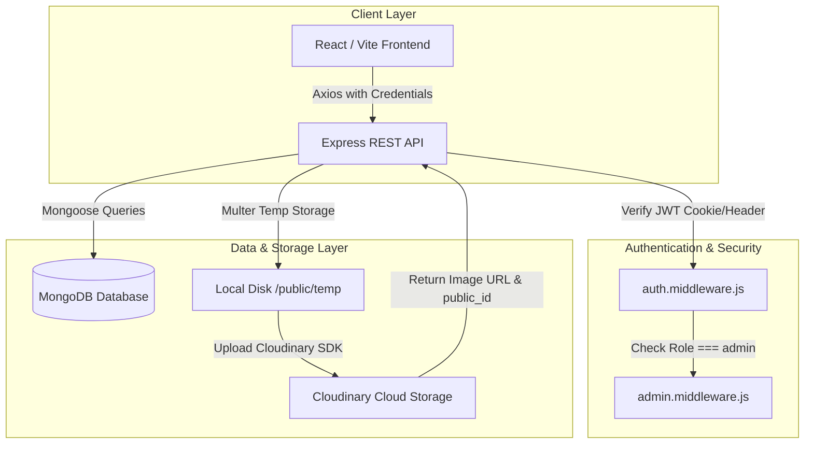
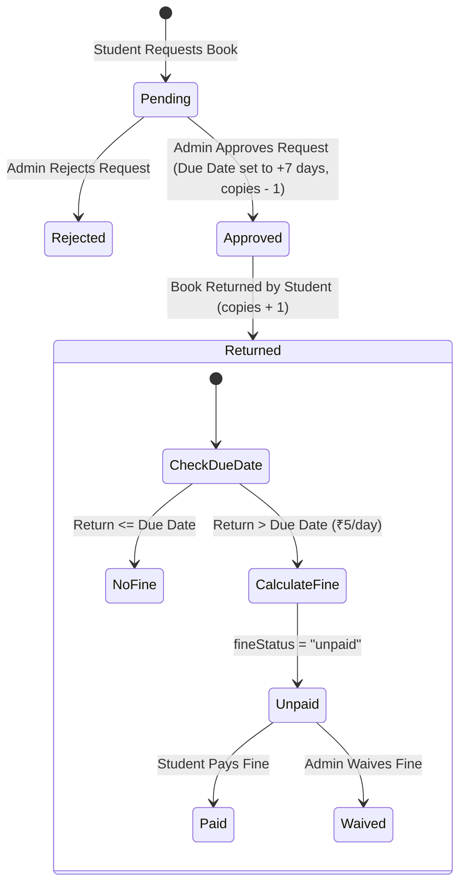

# Library Management System (LMS)

> A robust, full-stack, role-based web application for managing library catalogs, automated book issue workflows, fine calculations, user memberships, and community events.

---

## 📋 Table of Contents

- [Overview](#-overview)
- [Key Features](#-key-features)
  - [Student / Member Features](#student--member-features)
  - [Admin Features](#admin-features)
- [Tech Stack](#-tech-stack)
- [System Architecture](#-system-architecture)
- [Project Structure](#-project-structure)
- [Authentication & Authorization](#-authentication--authorization)
- [Book Management & Stock Tracking](#-book-management--stock-tracking)
- [Book Issue & Return Workflow](#-book-issue--return-workflow)
- [API Documentation](#-api-documentation)
- [Database Models](#-database-models)
- [Environment Variables](#-environment-variables)
- [Installation & Setup](#-installation--setup)
- [Running the Project](#-running-the-project)
- [API Testing](#-api-testing)
- [Frontend Architecture](#-frontend-architecture)
- [Deployment Guide](#-deployment-guide)
- [Security Considerations](#-security-considerations)
- [Future Improvements](#-future-improvements)
- [Screenshots](#-screenshots)
- [Contributing](#-contributing)
- [License](#-license)
- [Author](#-author)

---

## 🌟 Overview

The **Library Management System (LMS)** is a modern web application designed to streamline library administration and improve the borrowing experience for members. 

It eliminates manual register keeping by providing automated tracking of available book copies, real-time issue request processing, dynamic due-date calculation (+7 days upon approval), automated late fine calculation (₹5/day for overdue returns), fine waiver/payment management, member avatar uploads, and event announcements.

---

## ✨ Key Features

### Student / Member Features
* **Account Registration & Authentication**: Create a member account with custom profile picture upload. Secure login using JWT tokens via HTTP-only cookies.
* **Catalog Exploration & Search**: Browse all library books with real-time text search (title, author, category, ISBN) and category filtering.
* **Real-time Statistics**: View total catalog books, active library members, active borrows, and completed returns.
* **Book Issue Request**: Submit single-click request to issue a book. Prevents duplicate requests for already active/pending issues.
* **Personal Issued Books Dashboard ("My Issues")**: Track pending approval status, active borrowed books, due dates, return dates, and overdue fine status.
* **Fine Payment**: Settle overdue fines directly from the student dashboard.
* **Profile Management**: Update member contact details, update avatar, and change password securely.
* **Library Events**: View upcoming workshops, seminars, and library events.

### Admin Features
* **Centralized Admin Dashboard**: Overview of system activity, pending issue requests, return processing, catalog management, and event creation.
* **Book Catalog CRUD**: Add new books with cover image uploads stored on Cloudinary, update book details/stock, and delete books from the system.
* **Issue Request Moderation**: Review and Approve or Reject incoming student book requests.
* **Return Processing & Fine Automation**: Mark returned books, automatically restore available copy inventory count, and auto-calculate late fees if returned past the due date.
* **Fine Administration**: Waive late fines for students or monitor payment statuses.
* **System-wide Issue Monitoring**: Inspect all global issues with status filtering (`pending`, `approved`, `returned`, `rejected`) and search by student name/email or book title.
* **Event Management**: Publish new events and remove expired events.

---

## 🧪 Tech Stack

### Frontend
* **Core Library**: [React 19](https://react.dev/)
* **Build Tool**: [Vite](https://vitejs.dev/)
* **Routing**: [React Router DOM v7](https://reactrouter.com/)
* **HTTP Client**: [Axios](https://axios-http.com/)
* **Styling**: [Tailwind CSS v4](https://tailwindcss.com/)
* **Animations**: [Framer Motion](https://www.framer.com/motion/)
* **Icons**: [React Icons](https://react-icons.github.io/react-icons/)
* **Notifications**: [React Hot Toast](https://react-hot-toast.com/)

### Backend
* **Runtime**: [Node.js](https://nodejs.org/)
* **Framework**: [Express.js v5](https://expressjs.com/)
* **Database Driver**: [Mongoose v9](https://mongoosejs.com/)
* **Authentication**: [JSON Web Tokens (JWT)](https://jwt.io/), [bcrypt](https://github.com/kelektiv/node.bcrypt.js)
* **Cookies**: `cookie-parser`
* **File Handling**: [Multer](https://github.com/expressjs/multer)
* **Cloud Storage**: [Cloudinary SDK](https://cloudinary.com/)
* **Utilities**: `dotenv`, `cors`

### Database
* **Database Engine**: [MongoDB](https://www.mongodb.com/) / MongoDB Atlas

---

## 🏗️ System Architecture



---

## 📁 Project Structure

```text
LMS/
├── backend/
│   ├── public/
│   │   └── temp/                   # Temporary file storage for Multer uploads
│   ├── src/
│   │   ├── controllers/
│   │   │   ├── book.controller.js  # Book CRUD & Library Stats logic
│   │   │   ├── event.controller.js # Event creation, fetch & deletion
│   │   │   ├── issebook.controller.js # Issue requests, approvals, returns, fine logic
│   │   │   └── user.controller.js # Auth, profile management, JWT generation
│   │   ├── db/
│   │   │   └── ConnectDB.js        # MongoDB connection setup
│   │   ├── middlewares/
│   │   │   ├── admin.middleware.js # Admin role verification
│   │   │   ├── auth.middleware.js  # JWT verification middleware
│   │   │   └── multer.middleware.js# File upload middleware (disk storage)
│   │   ├── model/
│   │   │   ├── Announcement.model.js
│   │   │   ├── Book.model.js       # Book schema with text indexing
│   │   │   ├── Event.model.js      # Library event schema
│   │   │   ├── Issue.model.js      # IssueBooks schema (user, book, dates, status, fine)
│   │   │   └── User.Model.js       # User schema (password hashing, JWT helper methods)
│   │   ├── routes/
│   │   │   ├── book.route.js       # Book & Issue API endpoints
│   │   │   ├── event.route.js      # Event API endpoints
│   │   │   └── user.route.js       # User auth & profile endpoints
│   │   ├── services/
│   │   │   └── cloudinary.service.js # Cloudinary upload & local cleanup service
│   │   └── utils/
│   │       ├── ApiError.js         # Custom API Error class
│   │       ├── ApiResponse.js      # Custom API Response formatter
│   │       └── asyncHandler.js     # Async wrapper for route handlers
│   ├── .env                        # Backend environment configuration
│   ├── App.js                      # Express app setup, CORS, CookieParser, global errorHandler
│   ├── Index.js                    # Server startup script
│   └── package.json
│
└── frontend/
    ├── public/
    ├── src/
    │   ├── assets/
    │   ├── components/
    │   │   ├── admin/              # Admin dashboard components
    │   │   ├── cards/              # Card components
    │   │   ├── common/             # Common UI components
    │   │   ├── home/               # Landing page sections
    │   │   ├── student/            # Student dashboard components
    │   │   └── ui/                 # Reusable UI elements (Buttons, Inputs, Modals)
    │   ├── context/
    │   │   ├── AuthContext.jsx     # User authentication state & methods
    │   │   └── ThemeContext.jsx    # Theme context provider
    │   ├── pages/
    │   │   ├── AddBook.jsx         # Add new book page
    │   │   ├── AdminDashboard.jsx  # Admin panel page
    │   │   ├── Books.jsx           # Books catalog listing
    │   │   ├── Home.jsx            # Landing page
    │   │   ├── Login.jsx           # User authentication login
    │   │   ├── NotFound.jsx        # 404 page
    │   │   ├── Profile.jsx         # User profile settings page
    │   │   ├── Register.jsx        # User registration page
    │   │   └── StudentDashboard.jsx# Student dashboard page
    │   ├── services/
    │   │   └── api.js              # Axios instance configuration (withCredentials: true)
    │   ├── App.jsx                 # Routes declaration
    │   ├── main.jsx                # Entry point
    │   └── index.css               # Tailwind CSS imports and global styles
    ├── vite.config.js
    └── package.json
```

---

## 🔐 Authentication & Authorization

Authentication is handled via **JSON Web Tokens (JWT)** and **HTTP-only Cookies**:

1. **Registration**: 
   - Accepts user details (`firstName`, `lastName`, `email`, `contact`, `password`) and an avatar image.
   - Passwords are automatically hashed using `bcrypt` (10 rounds) before saving to MongoDB via Mongoose pre-save middleware.
   - Avatar is uploaded to Cloudinary, and the URL is stored in the user profile.

2. **Login & Tokens**:
   - Verifies credentials using `bcrypt.compare()`.
   - Generates two tokens:
     - **Access Token**: Short-lived payload containing user ID, email, and name (`process.env.ACCESS_SECRET_TOKEN`).
     - **Refresh Token**: Long-lived payload (`process.env.REFRESH_SECRET_TOKEN`) saved to the database record.
   - Both tokens are sent to the client via `httpOnly`, `sameSite` secured cookies (`accessToken`, `reFreshToken`).

3. **Authorization Middlewares**:
   - `verifyeJWT`: Checks `req.cookies.accessToken` or `Authorization: Bearer <token>` header, verifies JWT signature, attaches user to `req.user`.
   - `verifyAdmin`: Enforces that `req.user.role === 'admin'`. Returns `403 Forbidden` if unauthorized.

---

## 📚 Book Management & Stock Tracking

* **Book Schema**: Includes `title`, `description`, `category`, `author`, `copies`, `availableCopies`, `isbn`, and `cover` (`url`, `public_id`).
* **Search & Indexing**: Compound text indexes are created on `title`, `author`, and `isbn` for optimized database queries.
* **Automatic Stock Adjustment**:
  - Initial creation sets `availableCopies = copies`.
  - When an issue request is **approved**, `availableCopies` decrements by 1.
  - When an issued book is **returned**, `availableCopies` increments by 1.

---

## 🔄 Book Issue & Return Workflow



### Overdue Fine Logic:
- **Default Borrow Duration**: 7 Days from approval date.
- **Fine Calculation Formula**: If `returnDate > dueDate`:
  $$\text{Fine Amount} = \text{ceil}\left(\frac{\text{returnDate} - \text{dueDate}}{86400 \times 1000}\right) \times 5 \text{ (₹)}$$
- **Fine Status**: Set to `"unpaid"` if fine > 0, otherwise `"paid"`.
- **Administrative Control**: Admins can waive fines (`waive-fine`) or students can pay fines directly (`pay-fine`).

---

## 📡 API Documentation

### Base URL: `/api/v1`

#### User Endpoints (`/users`)
| Method | Endpoint | Description | Auth Required | Role |
| :--- | :--- | :--- | :---: | :---: |
| `POST` | `/users/register` | Register a new member (with avatar) | No | Public |
| `POST` | `/users/login` | Authenticate user & issue tokens/cookies | No | Public |
| `POST` | `/users/logout` | Revoke session & clear cookies | Yes | Any |
| `POST` | `/users/refresh-token` | Renew access token via refresh token | No | Public |
| `GET` | `/users/me` | Fetch current logged-in user profile | Yes | Any |
| `PATCH` | `/users/change-password` | Update account password | Yes | Any |
| `PATCH` | `/users/update-profile` | Update user name & contact | Yes | Any |
| `PATCH` | `/users/avtar` | Update user profile picture | Yes | Any |

#### Book & Issue Endpoints (`/books`)
| Method | Endpoint | Description | Auth Required | Role |
| :--- | :--- | :--- | :---: | :---: |
| `GET` | `/books/stats` | Get aggregate library metrics | No | Public |
| `GET` | `/books/get-all-Books` | List books (supports search, category filter, pagination) | No | Public |
| `GET` | `/books/get-book/:id` | Fetch specific book by ID | No | Public |
| `POST` | `/books/add-book` | Create new book record (with cover image) | Yes | **Admin** |
| `PATCH` | `/books/update-book/:id` | Edit book details or cover image | Yes | **Admin** |
| `DELETE` | `/books/delete-book/:id` | Remove a book from catalog | Yes | **Admin** |
| `POST` | `/books/request/:id` | Submit a request to issue a book | Yes | Student |
| `POST` | `/books/approve/:id` | Approve pending book request | Yes | **Admin** |
| `POST` | `/books/reject/:id` | Reject pending book request | Yes | **Admin** |
| `POST` | `/books/return/:id` | Process returned book & calculate fine | Yes | **Admin** |
| `POST` | `/books/pay-fine/:id` | Pay outstanding fine for an issue record | Yes | Any |
| `POST` | `/books/waive-fine/:id` | Waive fine for an issue record | Yes | **Admin** |
| `GET` | `/books/my-issues` | List current user's requested/borrowed books | Yes | Student |
| `GET` | `/books/all-issues` | System-wide view of all issues | Yes | **Admin** |

#### Event Endpoints (`/events`)
| Method | Endpoint | Description | Auth Required | Role |
| :--- | :--- | :--- | :---: | :---: |
| `GET` | `/events` | List all library events & announcements | No | Public |
| `POST` | `/events/create` | Publish a new library event | Yes | **Admin** |
| `DELETE` | `/events/delete/:id` | Delete an existing event | Yes | **Admin** |

---

## 🗄️ Database Models

### 1. User Model (`User.Model.js`)
```javascript
{
  firstName: { type: String, required: true, trim: true },
  lastName:  { type: String, required: true, trim: true },
  email:     { type: String, required: true, unique: true, trim: true, lowercase: true },
  contact:   { type: Number, required: true },
  password:  { type: String, required: true },
  avatar:    { type: String, default: "" },
  role:      { type: String, enum: ["student", "admin"], default: "student" },
  reFreshToken: { type: String }
} // timestamps: true
```

### 2. Book Model (`Book.model.js`)
```javascript
{
  title:           { type: String, required: true, trim: true },
  description:     { type: String, trim: true },
  cover:           { url: String, public_id: String },
  category:        { type: String, trim: true, lowercase: true },
  author:          { type: String, trim: true, lowercase: true },
  copies:          { type: Number, required: true },
  availableCopies: { type: Number, required: true },
  isbn:            { type: String, required: true, unique: true, trim: true }
} // timestamps: true
// Indexes: { category: 1 }, { createdAt: -1 }, text index on { title, author, isbn }
```

### 3. Issue Model (`Issue.model.js` -> Collection: `issueBooks`)
```javascript
{
  user:       { type: Schema.Types.ObjectId, ref: "User", required: true },
  book:       { type: Schema.Types.ObjectId, ref: "Book", required: true },
  issueDate:  { type: Date, default: Date.now },
  dueDate:    { type: Date },
  returnDate: { type: Date },
  status:     { type: String, enum: ["pending", "approved", "returned", "rejected"], default: "pending" },
  approvedBy: { type: Schema.Types.ObjectId, ref: "User" },
  fineAmount: { type: Number, default: 0 },
  fineStatus: { type: String, enum: ["unpaid", "paid", "waived"], default: "unpaid" }
} // timestamps: true
```

### 4. Event Model (`Event.model.js`)
```javascript
{
  title:       { type: String, required: true, trim: true },
  description: { type: String, required: true, trim: true },
  date:        { type: String, required: true },
  time:        { type: String, default: "10:00 AM - 4:00 PM" },
  location:    { type: String, default: "Central Library Auditorium" },
  category:    { type: String, default: "Workshop", trim: true },
  image:       { type: String },
  speaker:     { type: String, default: "Guest Speaker" }
} // timestamps: true
```

---

## 🔑 Environment Variables

### Backend Configuration (`backend/.env`)
Create a `.env` file in the `backend/` directory:

```env
# Server Configuration
PORT=8000
NODE_ENV=development

# Database Configuration
DB_NAME=LMS
db_url=mongodb+srv://<username>:<password>@cluster.mongodb.net/?appName=LMS

# JWT Configuration
ACCESS_SECRET_TOKEN=your_jwt_access_secret_key_here
ACCESS_TOKEN_EXPIRY=1d
REFRESH_SECRET_TOKEN=your_jwt_refresh_secret_key_here
REFRESH_TOKEN_EXPIRY=10d

# Cloudinary Configuration
CLOULDINARY_NAME=your_cloudinary_cloud_name
CLOULDINARY_API_KEY=your_cloudinary_api_key
CLOUDINARY_SECRATE=your_cloudinary_api_secret
```

### Frontend Configuration (`frontend/.env`)
Create a `.env` file in the `frontend/` directory (optional for custom host):

```env
VITE_API_URL=http://localhost:8000/api/v1
```

---

## ⚙️ Installation & Setup

### Prerequisites
* [Node.js](https://nodejs.org/) (v18 or higher recommended)
* [MongoDB](https://www.mongodb.com/) (Local instance or MongoDB Atlas URI)
* [Cloudinary Account](https://cloudinary.com/) (For image upload handling)

### Step 1: Clone Repository
```bash
git clone https://github.com/your-username/LMS.git
cd LMS
```

### Step 2: Install Backend Dependencies
```bash
cd backend
npm install
```

### Step 3: Install Frontend Dependencies
```bash
cd ../frontend
npm install
```

---

## 🚀 Running the Project

### Start Backend Development Server
From the `backend/` folder:
```bash
npm run dev
```
* The backend server will run on `http://localhost:8000`.

### Start Frontend Development Server
From the `frontend/` folder:
```bash
npm run dev
```
* The React application will run on `http://localhost:5173`.

---

## 🧪 API Testing

You can test all endpoints using [Postman](https://www.postman.com/) or Insomnia:

1. **Authentication Flow**:
   - Send `POST /api/v1/users/register` with `multipart/form-data` including text fields and an `avatar` image file.
   - Send `POST /api/v1/users/login` with JSON payload `{ "email": "admin@example.com", "password": "yourpassword" }`.
   - Ensure Postman cookie jar is enabled to automatically capture `accessToken` and `reFreshToken`.

2. **Protected Routes**:
   - Subsequent requests to protected routes will automatically transmit the session cookie or you can provide the token as `Bearer <accessToken>` in the `Authorization` header.

---

## 🎨 Frontend Architecture

The frontend is built with React 19 and Vite using functional components and React Context:

* **State Management (`AuthContext.jsx`)**: Manages authentication status, user state persisted in `localStorage`, login action with role-mismatch prevention, registration wrapper, and logout handler.
* **Routing (`App.jsx`)**: Configured with `react-router-dom` v7 providing paths for Home (`/`), Login (`/login`), Register (`/register`), Books (`/books`), Add Book (`/add-book`), Profile (`/profile`), Student Dashboard (`/student/dashboard`), and Admin Dashboard (`/admin/dashboard`).
* **API Layer (`services/api.js`)**: Configured Axios instance with dynamic base URL calculation and `withCredentials: true` enabled for cross-origin cookie processing.
* **UI & Styling**: Styled using Tailwind CSS v4 and animated using Framer Motion with toast alerts via React Hot Toast.

---

## 🌐 Deployment Guide

### Database (MongoDB Atlas)
1. Create a MongoDB Atlas Cluster and obtain the connection string (`mongodb+srv://...`).
2. Add your server's IP address to the Network Access whitelist.

### Cloud Storage (Cloudinary)
1. Sign up for a Cloudinary account.
2. Copy your Cloud Name, API Key, and API Secret into production environment variables.

### Backend Deployment (Render / Railway / Vercel Serverless)
1. Deploy the `backend/` directory.
2. Set Environment Variables (`db_url`, `ACCESS_SECRET_TOKEN`, `REFRESH_SECRET_TOKEN`, `CLOULDINARY_NAME`, etc.).
3. Set Build Command: `npm install` and Start Command: `node Index.js`.

### Frontend Deployment (Vercel / Netlify)
1. Deploy the `frontend/` directory.
2. Set Environment Variable `VITE_API_URL` pointing to your deployed backend URL (e.g., `https://your-api.onrender.com/api/v1`).
3. Set Build Command: `npm run build` and Output Directory: `dist`.

---

## 🔒 Security Considerations

* **Password Hashing**: Direct plain-text password storage is strictly avoided. All passwords undergo salt hashing (10 rounds of `bcrypt`).
* **Cookie Protection**: Authentication cookies use `httpOnly: true` (preventing XSS access) and `sameSite` configurations.
* **Role Enforcement**: Strict middleware checks prevent unauthorized users from escalating privileges to administrative actions.
* **Input Scrubbing & Sanitization**: Trimmed input fields and Mongoose schema constraints prevent invalid database insertions.
* **Temporary Storage Cleanup**: Files uploaded locally via Multer are unlinked immediately after upload to Cloudinary or upon upload failure.

---

## 🔮 Future Improvements

While the current system covers core LMS requirements, planned future extensions include:

- 📧 **Automated Email Notifications**: Sending automated email alerts via Nodemailer for due-date reminders and fine generation.
- ⏰ **Scheduled Overdue Cron Jobs**: Automated background cron jobs to check and recalculate daily fines for overdue items without requiring manual return triggers.
- 📷 **Physical Barcode / QR Code Scanner Sync**: Hardware scanner support for instant ISBN scanning during library checkout.
- 📊 **Analytics Export**: PDF and CSV export capabilities for administrative monthly circulation reports.
- 👥 **Multi-tier Role Management**: Introducing Librarian, Faculty, and Student tier distinctions with customized borrowing quotas.

---

## 🖼️ Screenshots

### Login
<!-- Add Login Screenshot Here -->

### Home / Landing Page
<!-- Add Home Screenshot Here -->

### Catalog & Book Management
<!-- Add Book Management Screenshot Here -->

### Issue Requests & Return Moderation
<!-- Add Issue Management Screenshot Here -->

---

## 🤝 Contributing

Contributions, issues, and feature requests are welcome!

1. Fork the Project.
2. Create your Feature Branch (`git checkout -b feature/AmazingFeature`).
3. Commit your Changes (`git commit -m 'Add some AmazingFeature'`).
4. Push to the Branch (`git checkout -b feature/AmazingFeature`).
5. Open a Pull Request.

---

## 📜 License

This project is licensed under the **ISC License**.

---

## 👤 Author

**Krupal**
* GitHub: [@Krupal-05](https://github.com/krupal-05)

---
*Generated for the Library Management System (LMS) codebase.*